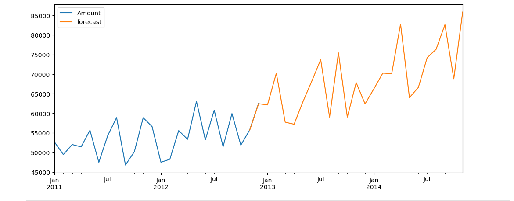
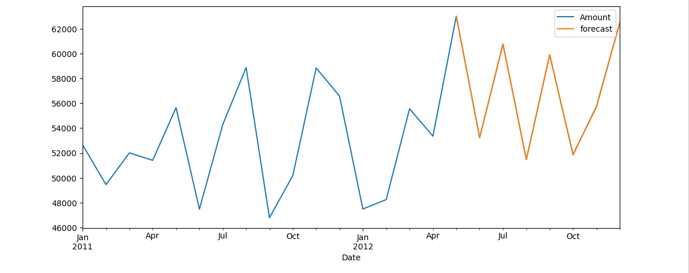

# Cab-Income-Forecasting-
Excited to share a recent achievement as a Data Analyst Team Leader at Betechnos Technology Private Limited!

I developed a predictive model for future forecasting on cab data using Python, analyzing two years of historical data to predict trends with 99% accuracy. Key tasks included:
Comprehensive data cleaning, handling missing values, and removing outliers to enhance model performance.
Leveraging statistical models such as ADFuller and SARIMAX for robust time series analysis.
Validating predictions through testing data and visualizing trends to accurately forecast future demand and patterns.
Looking forward to applying these insights and driving more data-driven decisions!

you can watch the full python video here:-
https://lnkd.in/ggqZ3Dgr

